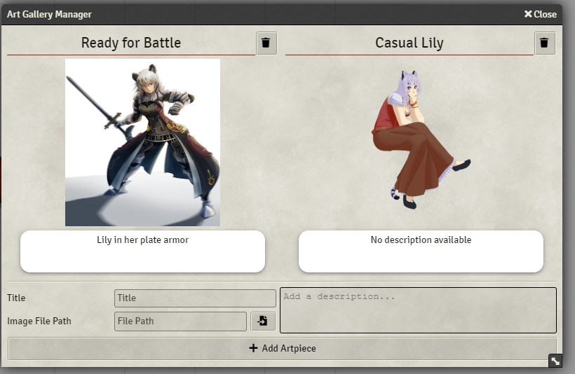

# README

## About

Welcome to Art Gallery. This module allows you to create a small gallery of pictures attached directly to an actor. Great if you have accumulated lots of cool art of your character over the course of a long campaign, or if you just want to have some relevant images "at hand".

## How to install

You can install Art Gallery either through the Foundry VTT setup by looking for it in the _Install Module_ Dialog or by copying the Manifest URL

`https://github.com/FloRad/art-gallery/releases/latest/download/module.json`

into the input box at the bottom of the dialog

## How to use

There are two ways to access the art gallery.

**1)** Right-clicking the actor in the Actor Directory.

**2)** In the header bar of the sheet

You can then directly add artpieces to the gallery. If you have permission to use the FileBrowser then a button will appear that let's you select a file from within it.

Inside the gallery you can zoom into each picture by clicking on it, which then also allows you to share it with other people

## Future

I have a few more features planned for this module, but they fall squarely into the realm of "when I feel like it"

Possible future features include, but are not limited to:

-   Albums
-   Permissions per image
-   Sharing images to only select people

## FAQ

**Q:** How do change titles and descriptions, or add them after I've added the image to the gallery? 
**A:** Easy, you just click on the text, and edit it directly. Only GMs and the owner of the Actor can do that.

## Getting Help

If something isn't working properly, or you've got questions or comments then feel free to hit me up on [Discord](https://discord.gg/DeCbb8xbUw) (@FloRad#2142), or file a [ticket]("https://gitlab.com/florad-foundry/art-gallery/-/issues).
